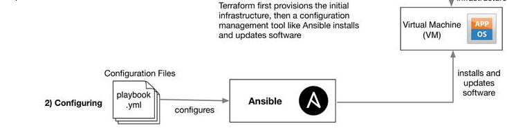

# Infrastructure as Code

## What is it?
Concept of infrastrcuture being managed by code and and software dev tools rather than manual processes. 
- Declare a programming language when defining the infrastructure and tools with use this code to automatically manage and configure the infrastructure
 
## Why should we use it?
1. Consistency & Reliability
   - As it is defined by code, we can keep the environment consistent each time and can reproduce the same thing each time
2. Automation
   - Automate the provision and managing of tasks, less human error and speeds up/ make it more efficient
3. Scalability
   - automated resources means can scale up and down based on demand
4. Version Control & Collaboration
   - Can use Git for Version Ctrl and teams can collaborate with code changes

## When to use it?
1. New project
   - set good foundation with concistency from the beginning
2. Scalability
   - can provision based on demand and scale looking at traffic
3. DevOps Practices
   - Fits with DevOps principles by automating software delivery process, provisioning and promotes collaboration
  
## Where to use it?
1. Cloud 
   - AWS, Azure, GCP 
2. Data centers
   - onsite data centers can use IaC to automate processes
3. Containerised environments 
   - Docker and Kubernetes have underlying infrastructure that needs to be managed and IaC can be used

## Tools
1. Terraform
   - open source tool allow to define and manage using declarative config language
2. AWS Cloud Formation
3. ARM Templates
4. Ansible
   - automation tool using YAML-based playbooks to define tasks and config

## Ansible
1. Open source automation tool
2. Config management, provisioning, app deployment, orchestration
3. Written in Python and YAML for congif files
4. Agentless architecture - connects to manages systems with SSH or WinRM
5. Powerful and Flexible

## Terraform
1. Open source tool developed by HashiCorp
2. Define, provision and manage infrastructure

## IaC - End to End infrastructure 
### Terraform: 
1. Provisioning:
   1. Terraform configures the provisioning of infrastructure 
   2. It uses .tf files with a runner file usually named main.tf
   3. `main.tf` - Specifify the configuration of the resources you need created and terraform will run
   4. Terraform will deploy to the cloud provider, the cloud provider will configure things like security groups etc
   5. But on this infrastructure, no software/app is installed which is where we use Ansible

### Ansible:
1. Configuring:
   1. Ansible configures the installation of updates and software
   2. Uses playbooks to make scripts and then they can be ran which deploys an app or a service
   3. So Ansible becomes the configuration management tool to install software
   4. Playbook is efficient because it can run on multiple instances at once

### How they work together?
Terraform configures and provisions the infrastructure and then Ansible wil configure and install the software on the infrastructure provisioned.

#### Why they should work together
1. Ansible could easily configure and provision infrastructure just like terraform using a playbook. But it becomes a larger task with more input and complexity needed. 
   - Ansible playbook to provision = 50+ lines whereas Terraform provisioning script = ~10 lines
2. Terraform provisioning of infrastructure can be reused and maintained using the simple main.tf file therefore terraform to provision!
#### *"Terraform builds the house and Ansible decorates it"*
