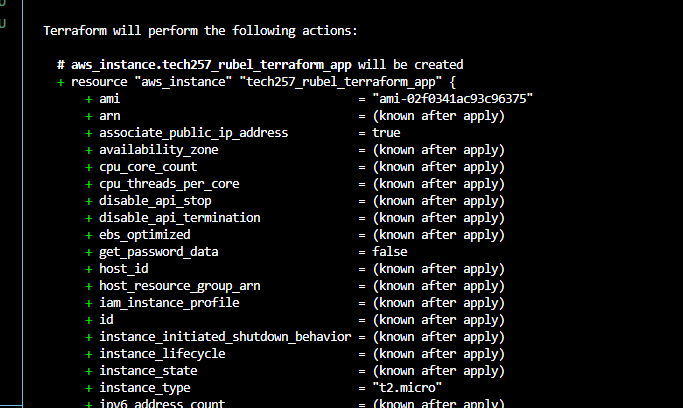
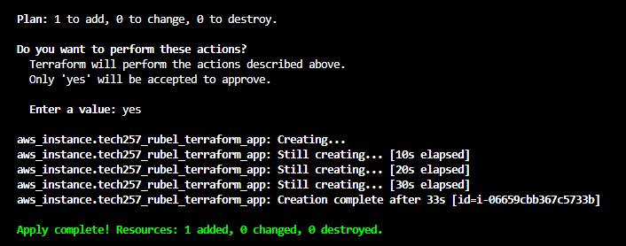

# Terraform

## R&D
### What is it?
1. Open source tool developed by HashiCorp
2. Define, provision and manage infrastructure

### Why use it?
1. Automation: 
   - automate provisioning of the infrastructure so decreases human error
2. Consistency & Reproducibility
   - using the same code template each time makes the creation consistent, can reproduce it same each time
3. DevOps
   - Collaboration
   - Automation
   - Scalabaility

### What is Orchestration with Terraform?
Process of managing the deployment and cycle of use of the infrastructure resources
- Terraform is used to define the resources that need to be deployed in a certain order 
- Orchestration takes those definitions and automates deployment and management of the resources.

## Creating ec2 instance
1. Create `main.tf` file - script to create resources
2. Where to create it, which cloud provider: `provider "aws"` followed by a `{`
3. Which region: `region = "eu-west-1"` and then close `}`
4. run `terraform init` to initialise everything
5. Which service do you want to use with service name: `resource "aws_instance" "tech257_rubel_terraform_app"` 
   - followed by a `{` as we will put the details of service
   1. AMI ID: `ami = "ami-02f0341ac93c96375"`
   2. type of instance: `instance_type = "t2.micro"`
   3. adding a public ip to the instance: `associate_public_ip_address = true`
6. Terraform will then look for the access key and secret access key in order to verify and access AWS:
   - Setup: go to system properties -> advanced settings -> environment variables -> new -> create two variables, one for access and on for secret
7. Name the service: `tags = { Name = ...}`
8. `}` close as the script is finished
9. `terraform plan` - creates an execution plan by showing what we have specified that will be added
    
10. `terraform apply` - applies the plan and creates what we have made
    

### Terraform Commands
- `terraform init` - initialising what has been provided through plugins
- `terraform plan` - creates execution plan that will be followed with what has been specified
- `terraform apply` - apply the plan that was made and creates what you want created
- `terraform destroy` - destroys the service that was created

## What is the push and pull configuration management which tools support pull/push?
2 Approaches to managing and deploying configurations: push and pull

### Push:
- central server pushes configuration to managed nodes
- uses protocols like ssh and agents installed
Adv:
- small changes are quicker this way
- the server has full control over the process
DisAdv:
- larger installations may result in increased server load, which could cause bottlenecks.
  
### Pull:
- managed nodes pull the desired configs from server regularly or when triggered to
- Clients use agent to connect to the server and apply it locally
Adv:
- stable for larger deploys, easier to distrubute load
- less strain on server
DisAdv:
- the initial configuration will need to be setup manually
- will be slower than a push