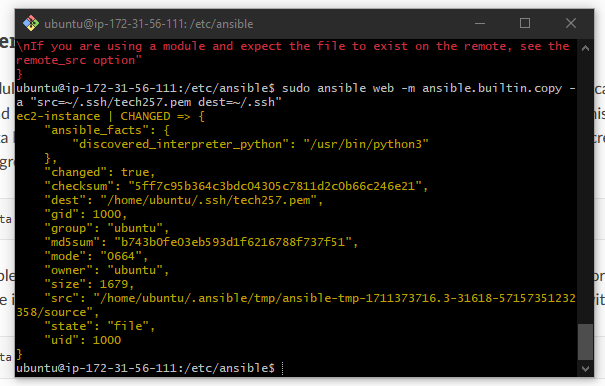
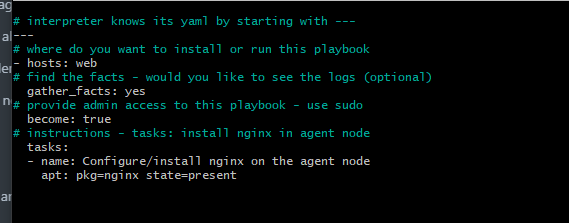
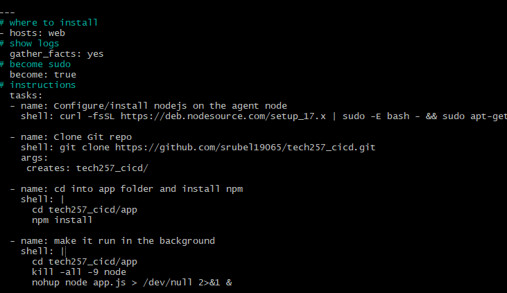

# Ansible

# Properties of Ansible
1. Ansible Controller 
   - Command center which controls ansible
   - Where we write the playbooks
     - Playbooks are the scripts defined for infrastrucutre config/tasks
   - Hosts files - Has the path to all endpoints (ip)
2. Agent node
   - Managed nodes that perform tasks
   - But Ansible is agentless, so we connect through SSH and dont need to install dependencies for it to work

## SSH into Ansible 
1. Create Ansible controller ec2 with SG port 22 open 
2. Create 2nd ec2 which will be Ansible agent node
3. Ssh into the Ansible Controller
4. Update and upgrade 
5. `sudo apt-get install software-properties-common` - install common properties
6. `sudo apt-add-repository ppa:ansible/ansible` - adds the ansible repo from official ansible documentation
7. can do an update just in case
8. `sudo apt-get install ansible` - installs ansible onto the vm
9. `cd /etc/ansible` - cd into the ansible directory which should have the hosts file and config file
10. `cd ~/.ssh` cd into ssh file which we will need to have our pem file key linked to the ec2 instance
    1. Create a nano file for the key
    2. On local host, go the key and cat, copy paste and put in the file created
11. `sudo chmod 400 <file>` - give read permissions to the file 
12. **SSH into agent inside controller** - to check if it worked then do `ansible --version` and it should say command not found

## Communicating controller to agents
The controller coomunicates to the nodes but they are agentless. So to communicate we need to give ansible a place to send information to and this is the *HOSTS* file. It stored endpoints
1. `sudo nano hosts` - open hosts file to insert endpoint
2. `ec2-instance ansible_host=<agent ip>ansible_user=ubuntu ansible_ssh_private_key_file=~/.ssh/<key>` - Above this will need to add `[GroupName]` as it indicates all endpoints below it are part of a group
3. `sudo ansible all -m ping` - pings all hosts and gives a reply of 'pong' if success

## Adhoc Commands
Ansible uses adhoc commands to automate single tasks to multiple nodes, Very simple
1. Follows: `sudo ansible <group if needed>-a "<what you want it to do>"`
2. e.g; `sudo ansible web -a "uname -a"`

### Copying pem file to node:
   - `sudo ansible web -m ansible.builtin.copy -a "src=~/.ssh/tech257.pem dest=~/.ssh`
  

## Playbook
**A playbook is the script that is used for ansible, uses yaml**

### Steps for nginx playbook
1. `sudo nano <playbook-name>`
2. We need to give it commands:
   1. `---`  this is at the beginning and shows interpreter that it is a yaml file
   2. `gather_facts: yes` - shows logs, this is optional and isnt needed
   3. `become: true` - this gives sudo permissions
   4. `tasks:` - everything after this is the instructions for each task that is specified
3. Indentation matters 

#### nginx playbook
1. `---`  this is at the beginning and shows interpreter that it is a yaml file
2. `gather_facts: yes` - shows logs, this is optional and isnt needed
3. `become: true` - this gives sudo permissions
4. Name the task and to install nginx, you use `apt: pkg=nginx state=present` - this installs nginx and makes it run

### node playbook
1. `---`  this is at the beginning and shows interpreter that it is a yaml file
2. `gather_facts: yes` - shows logs, this is optional and isnt needed
3. `become: true` - this gives sudo permissions
4. Tasks:
   1. install nodejs - if you specificy `shell: ...` you can put in shell commands
   2. Clone the git repo that has the app folder
   3. Cd into the app folder and install npm
       - if you use `|` it allows multi line command entering
   4. First go to the agent app and do npm start and the app should run
   5. Go back to the controller script and make it run in the background by killing any node processes and then using `nohup node app.js > /dev/null 2>&1 &` 
   
    